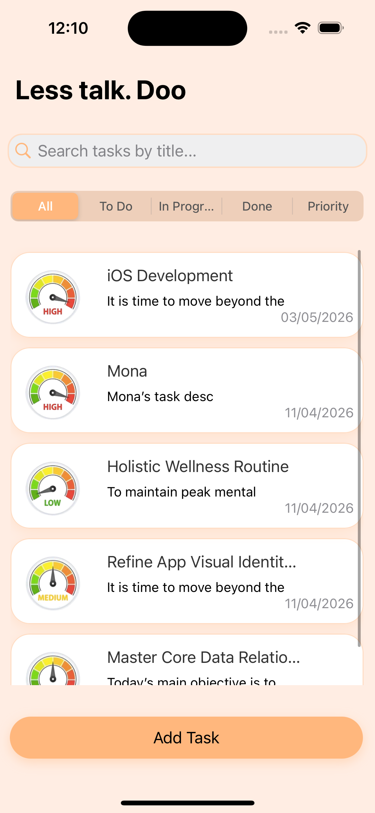
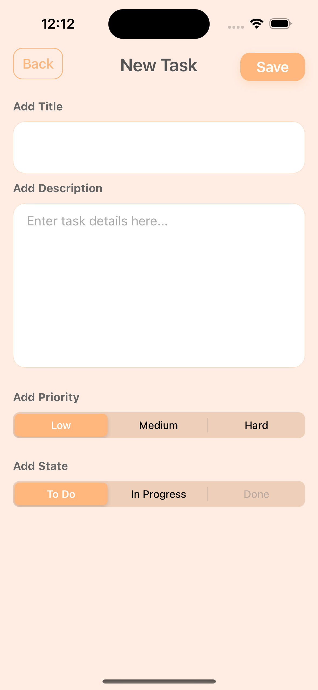
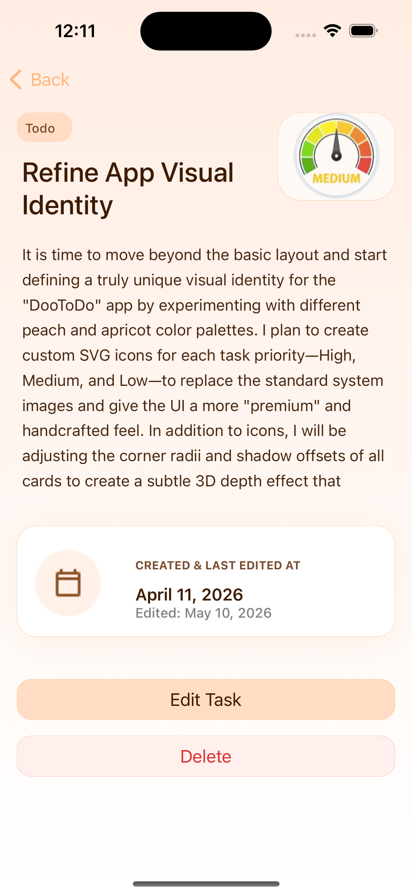
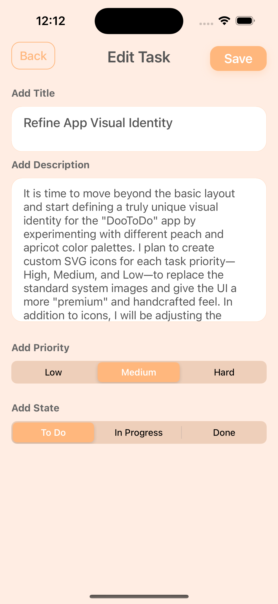
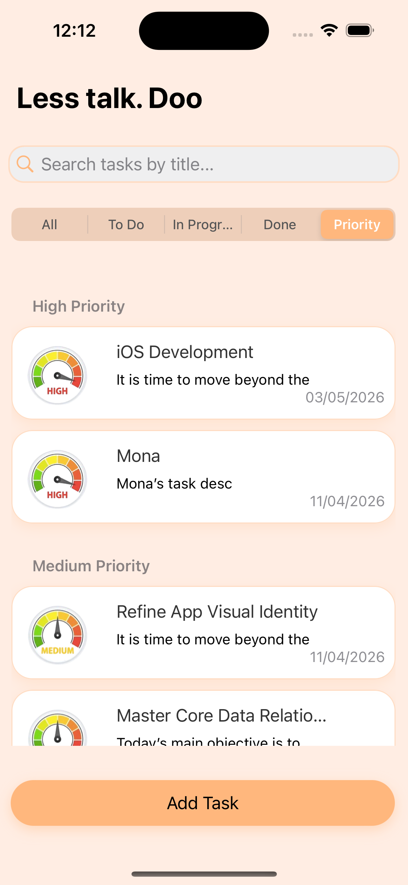

# ✅ Doo - ToDo List iOS Application

**Doo** is a simple and powerful To-Do List application for iOS that helps users organize, prioritize, and track their daily tasks efficiently.

Built using **Objective-C** and **UIKit**, the application uses **Core Data** for local persistence, allowing all tasks and updates to be saved permanently on the device.

---

## 📱 Screenshots

> Add screenshots of your app here.

| Home Screen | Add Task | Task Details |
|-----------|-----------|-----------|
|  |  |  |

| Edit Screen | priority segment  |
|-----------|-----------|
|  |  | 

---

## 🚀 Features

### 📝 Task Management
- Add new tasks with:
  - Title
  - Description
  - Priority (`High`, `Medium`, `Low`)
  - Automatic creation date
- View all tasks
- View detailed information for each task
- Edit existing tasks
- Delete tasks
- Search tasks by name

### 🎯 Task Priorities
Each priority level is represented with a unique image/icon:
- 🔴 High Priority
- 🟡 Medium Priority
- 🟢 Low Priority

### 📌 Task Status Workflow
Tasks can move through the following statuses:
- **To-Do**
- **In Progress**
- **Done**

#### Status Rules
- `In Progress` tasks cannot return to `To-Do`
- `Done` tasks cannot return to `In Progress`

### 🔍 Search Functionality
- Search tasks by title
- Displays a friendly message when no matching tasks are found

### 🗂️ Filtering and Sorting
Using a **UISegmentedControl**, users can filter tasks by:
- All Tasks
- To-Do
- In Progress
- Done
- Priority

When viewing by priority, tasks are grouped into sections:
- High Priority
- Medium Priority
- Low Priority

### 💾 Local Data Persistence
- All tasks and modifications are stored locally using **Core Data**
- Data remains available even after closing and reopening the app

### ⚠️ Edit Confirmation
- Users are asked for confirmation before saving changes to an edited task

---

## 🛠️ Technologies Used

- **Objective-C**
- **UIKit**
- **Core Data**
- **UITableView**
- **UISegmentedControl**
- **UISearchBar**
- **Auto Layout**

---

## 🏗️ Architecture

The app follows the **MVC (Model-View-Controller)** design pattern:

- **Model** → Core Data entities and task objects
- **View** → Storyboards and UIKit components
- **Controller** → ViewControllers managing user interaction and business logic

---

## 📂 Core Data Entity

### Task Entity Attributes

| Attribute | Type |
|--------|--------|
| title | String |
| taskDescription | String |
| priority | String |
| status | String |
| createdAt | Date |

---

## 📋 User Flow

1. Launch the application
2. View all saved tasks
3. Add a new task
4. Assign a priority
5. Track progress by updating status
6. Search or filter tasks
7. Edit or delete tasks as needed

---

## 🧠 Learning Outcomes

This project helped me practice:

- Objective-C syntax and OOP concepts
- Core Data CRUD operations
- Data persistence in iOS
- UITableView with sections
- UISegmentedControl filtering
- Search implementation
- MVC architecture
- Alert confirmations

---

## 🎨 Priority Icons

The app includes custom icons for each task priority:

- `high.png`
- `medium.png`
- `low.png`

These icons provide a visual indicator for task importance.

---
## 🎥 Demo Video

[Watch the Demo Video](demo/Simulator Screen Recording - iPhone 15 Pro - 2026-05-03 at 16.42.01.mp4.mp4)

## 📦 Installation

1. Clone the repository:
   ```bash
   git clone https://github.com/your-username/doo-todo-app.git
